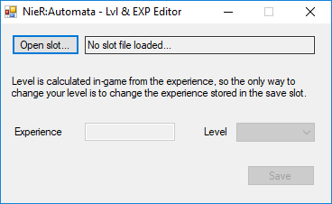

# NieR: Automata - Lvl & EXP Editor
An save editor for NieR: Automata that allows the editing of experience and levels of a save slot.

This have only been briefly tested with various saves, so ensure you have backups before making full use of it.

## Features

* Easily change the level or experience of your save.

## Requirement

* .NET Framework 4

## Usage

1. Download the editor from [the release section](https://github.com/Idearum/NieRAutomata_LVL-EXP_Editor/releases).

2. Run the tool and open one of the slot data files of NieR:Automata:

   - **SlotData_0.dat** - save slot #1
   - **SlotData_1.dat** - save slot #2
   - **SlotData_2.dat** - save slot #3

3. Use the level list to select a level directly, or manually input the experience you want in the textbox to the left.

5. Click on **Save** to save your changes to the slot data file.

## Known Issues

* No telling what havoc this editor can cause.

* I once, while barely awake in the middle of the night, had the tool fail on me and seemingly corrupt one of my save files so I had to restore it from a backup. I haven't been able to reproduce that issue, though, so it was probably caused by my half-asleep brain.

## License

The code for the editor is covered by [LICENSE](LICENSE).
